# Arquitetura Detalhada do Sistema

## Visão Geral

O **DataDialogue** é construído com uma arquitetura modular baseada em agentes inteligentes usando **LangGraph**, uma biblioteca para orquestração de fluxos com LLMs. O sistema traduz perguntas em linguagem natural para queries SQL, executa-as e apresenta resultados com visualizações automáticas.

## Arquitetura de Alto Nível

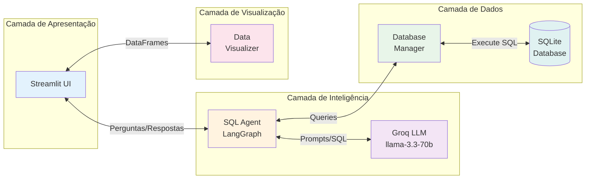

## Componentes Principais

### 1. SQLAgent (Motor de IA)

**Arquivo:** `src/agents/sql_agent.py`

**Responsabilidade:** Core do sistema - gerencia todo o fluxo de processamento de perguntas usando uma máquina de estados.

#### Estados do Agente (AgentState)

```python
class AgentState(TypedDict):
    messages: List[BaseMessage]      # Histórico de mensagens
    question: str                     # Pergunta original
    schema: str                       # Schema do banco
    sql_query: str                    # Query SQL gerada
    query_result: Any                 # Resultado da query
    error_message: str                # Mensagem de erro (se houver)
    attempt_count: int                # Número de tentativas
    final_answer: str                 # Resposta final formatada
    reasoning_steps: List[str]        # Passos de raciocínio
```

#### Grafo de Estados (LangGraph)

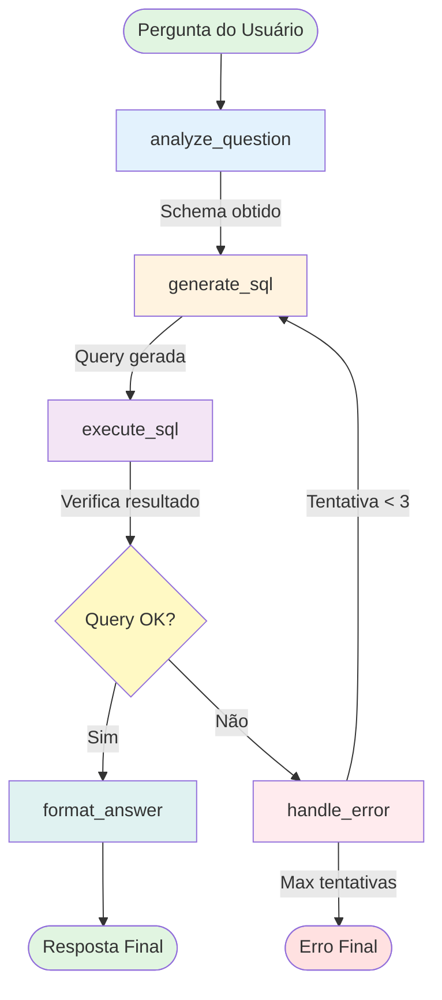

**Legenda:**
- **Entrada**: Pergunta em linguagem natural
- **Análise**: Obtém schema e prepara contexto
- **Geração**: LLM cria query SQL
- **Execução**: Roda query no banco
- **Decisão**: Verifica sucesso/erro
- **Formatação**: Resposta em português
- **Tratamento**: Recuperação de erros (até 3 tentativas)

#### Fluxo Detalhado de Cada Nó

```mermaid
flowchart TD
    subgraph "analyze_question"
        A1[Recebe pergunta do usuário]
        A2[Obtém schema via DatabaseManager]
        A3[Prepara contexto para LLM]
        A4[Inicializa tracking de raciocínio]
        A1 --> A2 --> A3 --> A4
    end
    
    subgraph "generate_sql"
        B1[Monta prompt com schema + pergunta]
        B2{É retry?}
        B2 -->|Sim| B3[Adiciona erro anterior ao prompt]
        B2 -->|Não| B4[Prompt padrão]
        B3 --> B5[Invoca LLM Groq]
        B4 --> B5
        B5 --> B6[Extrai SQL da resposta]
        B6 --> B7[Remove formatação markdown]
    end
    
    subgraph "execute_sql"
        C1[Recebe query SQL]
        C2[DatabaseManager.execute_query]
        C3{Sucesso?}
        C3 -->|Sim| C4[Retorna DataFrame]
        C3 -->|Não| C5[Retorna mensagem de erro]
    end
    
    subgraph "handle_error"
        D1[Recebe erro SQL]
        D2[Incrementa contador de tentativas]
        D3{Tentativas < 3?}
        D3 -->|Sim| D4[Prepara contexto para retry]
        D3 -->|Não| D5[Retorna erro final]
    end
    
    subgraph "format_answer"
        E1[Recebe dados + query]
        E2[Invoca LLM para formatação]
        E3[Gera resposta em português]
        E4[Adiciona insights dos dados]
        E1 --> E2 --> E3 --> E4
    end
    
    style A1 fill:#e3f2fd
    style B1 fill:#fff3e0
    style C1 fill:#f3e5f5
    style D1 fill:#ffebee
    style E1 fill:#e0f2f1
```

### 2. DatabaseManager (Gerenciador de Dados)

**Arquivo:** `src/utils/database.py`

**Responsabilidade:** Abstração para operações com SQLite.

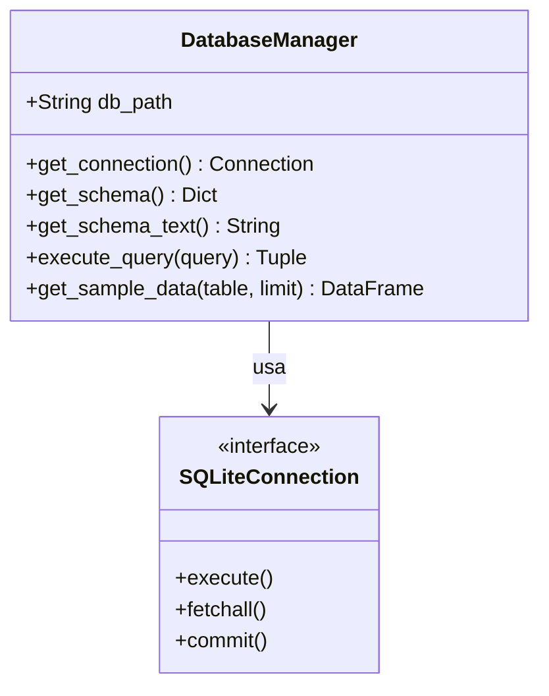

#### Métodos Principais

| Método | Entrada | Saída | Descrição |
|--------|---------|-------|-----------|
| `get_schema()` | - | `Dict[str, List[Dict]]` | Schema completo (tabelas, colunas, tipos) |
| `get_schema_text()` | - | `str` | Schema formatado para LLM com exemplos |
| `execute_query()` | `str` (SQL) | `Tuple[bool, Any]` | Executa query, retorna (sucesso, dados/erro) |
| `get_sample_data()` | `str, int` | `DataFrame` | Obtém exemplos de uma tabela |

### 3. DataVisualizer (Visualizações)

**Arquivo:** `src/utils/visualizations.py`

**Responsabilidade:** Criação automática de gráficos apropriados.

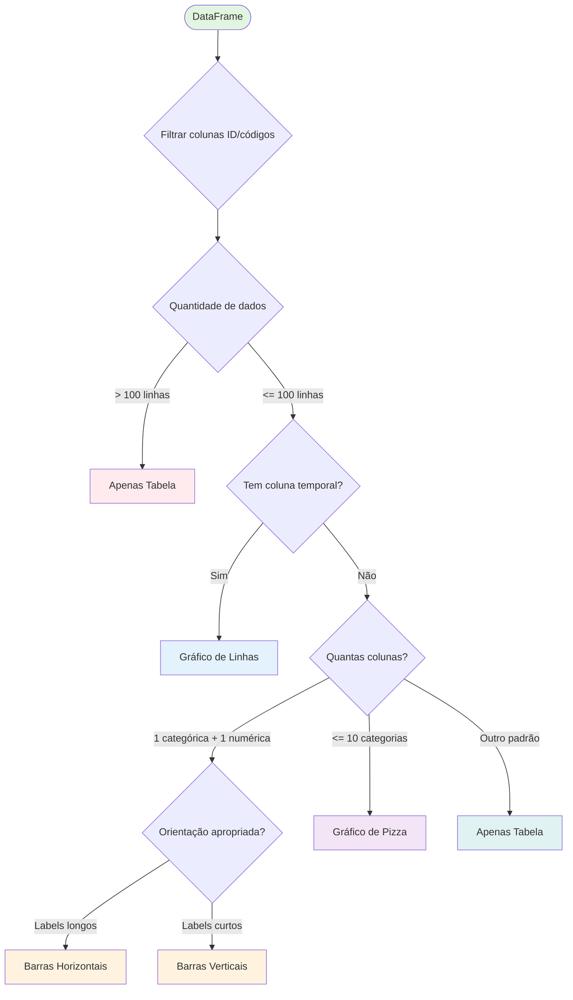

#### Tipos de Gráficos

| Tipo | Quando Usar | Características |
|------|-------------|-----------------|
| **Barras** | Comparações, rankings | Horizontal se labels > 15 chars |
| **Linhas** | Tendências temporais | Detecta colunas de data automaticamente |
| **Pizza (Donut)** | Distribuições ≤ 10 categorias | Mostra proporções |
| **Tabela** | > 100 linhas ou > 10 colunas | Fallback seguro |

### 4. Interface Streamlit

**Arquivo:** `app.py`

**Responsabilidade:** UI/UX - interface web interativa.

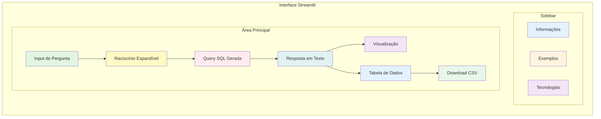

#### Funcionalidades da Interface

**1. Entrada de Pergunta**
- Text area para perguntas livres
- Botões de exemplo  interativos (sidebar)
- Validação de entrada não-vazia

**2. Processamento**
- Spinner com feedback visual
- Execução assíncrona do agente
- Tratamento de erros com mensagens claras

**3. Exibição de Resultados**
- **Raciocínio**: Passos do agente (expandível)
- **Query SQL**: Código formatado com syntax highlight
- **Resposta**: Texto em linguagem natural
- **Dados**: Tabela interativa + gráfico automático
- **Download**: Exporta para CSV

**4. Estado da Sessão**
```python
st.session_state.agent              # Agente (cache)
st.session_state.current_question   # Pergunta ativa
st.session_state.agent_ready        # Status de inicialização
```

## Fluxo de Dados Completo

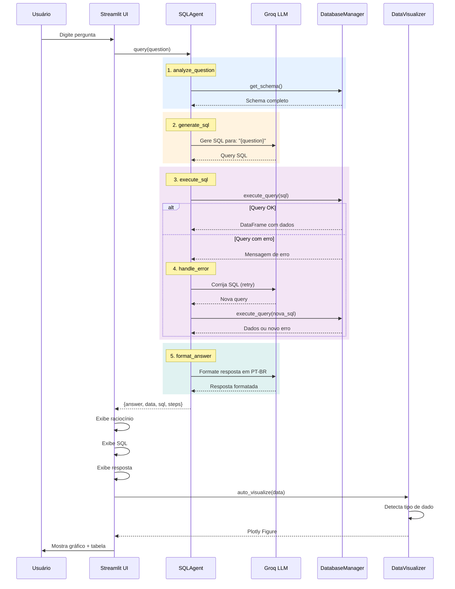

## Padrões de Design Utilizados

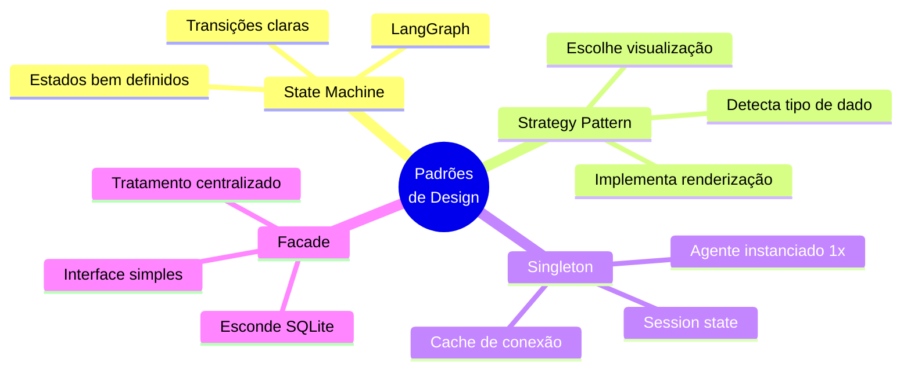

### 1. State Machine (LangGraph)
- **Estados bem definidos**: Cada nó tem responsabilidade única
- **Transições claras**: Decisões determinísticas baseadas em resultados
- **Fluxo recuperável**: Suporta retry com limite de tentativas

### 2. Strategy Pattern (Visualizações)
- **Detecta tipo de dado**: Análise automática de colunas
- **Escolhe estratégia**: Seleciona visualização apropriada
- **Implementa renderização**: Cria gráfico Plotly específico

### 3. Singleton (Session State)
- **Agente instanciado uma vez**: Cache em `st.session_state`
- **Conexão reutilizada**: Evita overhead de inicialização
- **Estado persistente**: Mantém contexto entre interações

### 4. Facade (DatabaseManager)
- **Interface simples**: Métodos de alto nível
- **Esconde detalhes**: Abstrai SQLite e pandas
- **Tratamento centralizado**: Erros capturados e formatados

## Pontos de Extensão

### 1. Adicionar Novos Tipos de Visualização

```python
# Em src/utils/visualizations.py
class DataVisualizer:
    
    @staticmethod
    def create_heatmap(df: pd.DataFrame, x_col: str, y_col: str, value_col: str) -> go.Figure:
        """Cria mapa de calor para dados cruzados."""
        pivot = df.pivot_table(values=value_col, index=y_col, columns=x_col)
        fig = go.Figure(data=go.Heatmap(z=pivot.values, x=pivot.columns, y=pivot.index))
        return fig
    
    def auto_visualize(self, df: pd.DataFrame) -> go.Figure:
        # Adicionar condição
        if self._is_cross_tabular_data(df):
            return self.create_heatmap(df, x_col, y_col, value_col)
```

### 2. Suportar Outros Bancos de Dados

```python
# Criar src/utils/postgres_manager.py
import psycopg2
from src.utils.database import DatabaseManager

class PostgresManager(DatabaseManager):
    """Adaptador para PostgreSQL."""
    
    def __init__(self, connection_string: str):
        self.conn_string = connection_string
    
    def get_connection(self):
        return psycopg2.connect(self.conn_string)
    
    def get_schema(self) -> Dict:
        # Implementar com information_schema
        pass
```

### 3. Adicionar Memória de Conversação

```python
# Em src/agents/sql_agent.py
from langchain.memory import ConversationBufferMemory

class SQLAgent:
    def __init__(self, ...):
        self.memory = ConversationBufferMemory(
            memory_key="chat_history",
            return_messages=True
        )
    
    def query(self, question: str) -> Dict:
        # Incluir histórico no contexto
        history = self.memory.load_memory_variables({})
        
        # ... processamento ...
        
        # Salvar na memória
        self.memory.save_context(
            {"input": question},
            {"output": result["answer"]}
        )
```

### 4. Implementar Agente Multi-Modal

```python
# Criar src/agents/orchestrator.py
from langgraph.graph import StateGraph

class MultiAgentOrchestrator:
    def __init__(self):
        self.sql_agent = SQLAgent(...)
        self.chart_agent = ChartAgent(...)
        self.summary_agent = SummaryAgent(...)
    
    def build_graph(self):
        workflow = StateGraph(OrchestratorState)
        
        workflow.add_node("route", self.route_question)
        workflow.add_node("sql", self.sql_agent.query)
        workflow.add_node("chart", self.chart_agent.recommend)
        workflow.add_node("summary", self.summary_agent.summarize)
        
        # Definir rotas...
        return workflow.compile()
```

## Segurança e Boas Práticas

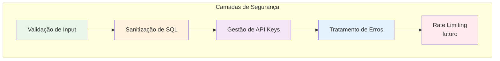

### 1. Validação de SQL
- Apenas SELECT queries são executadas por padrão
- Sem DELETE, DROP, UPDATE sem aprovação explícita
- TODO: Timeout para queries longas (futuro)

### 2. Gestão de API Keys
- Nunca commitar `.env` (incluído em `.gitignore`)
- Usar variáveis de ambiente (`GROQ_API_KEY`)
- Validação antes de uso (`check_setup.py`)

### 3. Tratamento de Erros
- Try-catch em todos os pontos críticos
- Mensagens claras para usuário final
- Logging estruturado (via `reasoning_steps`)

### 4. Performance
- Cache do schema (não muda frequentemente)
- Limite de tentativas (max 3 retries)
- Reuso da conexão LLM (singleton)
- TODO: Conexão pool para múltiplos usuários

## Métricas e Observabilidade (Roadmap)

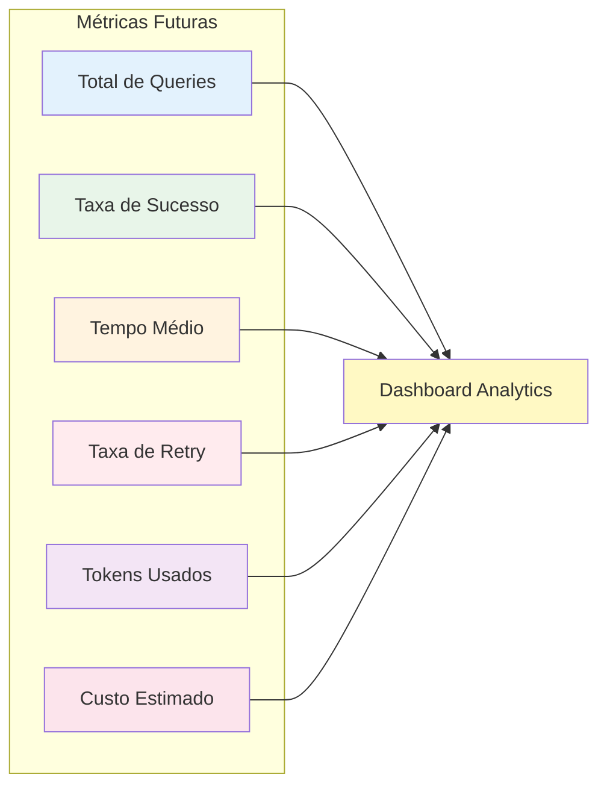

**Métricas Planejadas:**
```python
metrics = {
    "total_queries": count,           # Total de perguntas processadas
    "success_rate": percentage,       # Taxa de sucesso (query executada)
    "avg_response_time": seconds,     # Tempo médio de resposta
    "retry_rate": percentage,         # Frequência de retries necessários
    "tokens_used": count,             # Tokens consumidos (Groq)
    "estimated_cost": dollars,        # Custo estimado de API
    "popular_questions": list,        # Perguntas mais frequentes
    "error_types": dict              # Tipos de erro mais comuns
}
```

## Conclusão

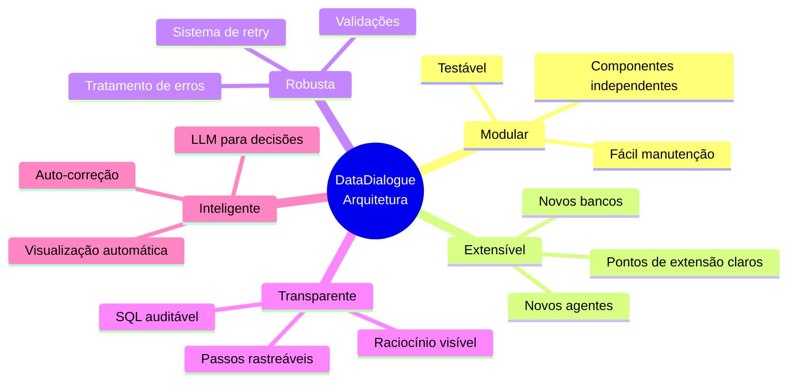

A arquitetura foi projetada para ser:

- **Modular**: Componentes independentes com responsabilidades claras
- **Extensível**: Fácil adicionar funcionalidades sem quebrar código existente
- **Robusta**: Tratamento de erros e mecanismo de retry automático
- **Transparente**: Mostra todo o raciocínio e passos de execução
- **Inteligente**: Usa LLM para decisões complexas e auto-correção

O uso de **LangGraph** permite criar fluxos sofisticados de agentes mantendo o código limpo, testável e fácil de entender. A combinação com **Groq** (modelo llama-3.3-70b-versatile) garante respostas rápidas e precisas.

---

**Para mais detalhes técnicos:**
- [README.md](README.md) - Visão geral e quick start
- [Código-fonte](src/) - Implementação completa
- [Exemplos](EXAMPLES.md) - Casos de uso reais
- [Contribuindo](CONTRIBUTING.md) - Como colaborar

