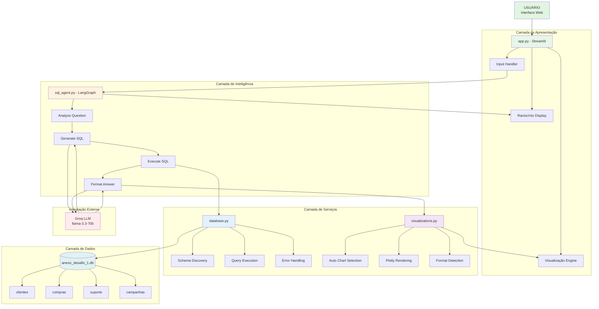
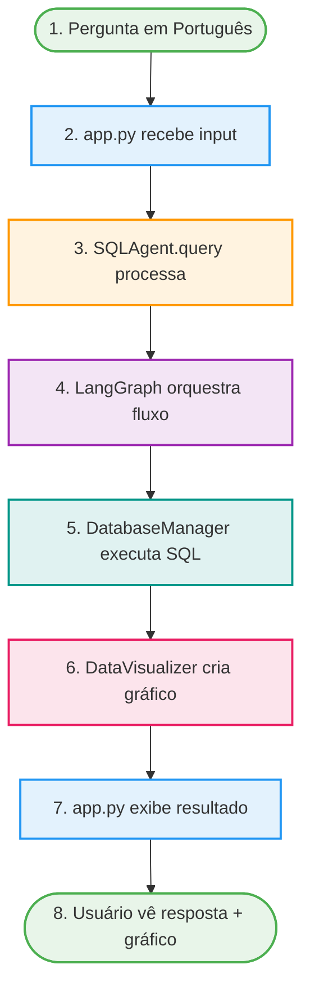

# Estrutura Completa do Projeto

## Visão Geral da Estrutura de Pastas

```mermaid
graph TB
    Root[Desafio1/]
    
    subgraph "Banco de Dados"
        DB[(anexo_desafio_1.db<br/>SQLite Database)]
    end
    
    subgraph "Aplicação Principal"
        APP[app.py<br/>Streamlit Interface]
    end
    
    subgraph "Código Fonte"
        SRC[src/]
        AGENTS[agents/<br/>sql_agent.py]
        UTILS[utils/<br/>database.py<br/>visualizations.py]
        SRC --> AGENTS
        SRC --> UTILS
    end
    
    subgraph "Testes & Scripts"
        TEST1[test_agent.py]
        TEST2[explore_db.py]
        TEST3[check_setup.py]
    end
    
    subgraph "Inicialização"
        START1[start.bat Windows]
        START2[start.sh Linux/Mac]
    end
    
    subgraph "Documentação"
        DOC1[README.md]
        DOC2[INSTALL.md]
        DOC3[ARCHITECTURE.md]
        DOC4[EXAMPLES.md]
        DOC5[CONTRIBUTING.md]
    end
    
    subgraph "Configuração"
        CONF1[requirements.txt]
        CONF2[.env.example]
        CONF3[.gitignore]
        CONF4[LICENSE]
    end
    
    Root --> DB
    Root --> APP
    Root --> SRC
    Root --> TEST1
    Root --> TEST2
    Root --> TEST3
    Root --> START1
    Root --> START2
    Root --> DOC1
    Root --> DOC2
    Root --> DOC3
    Root --> DOC4
    Root --> DOC5
    Root --> CONF1
    Root --> CONF2
    Root --> CONF3
    Root --> CONF4
    
    style Root fill:#f9f9f9,stroke:#333,stroke-width:3px
    style DB fill:#e3f2fd
    style APP fill:#e8f5e9
    style SRC fill:#fff3e0
    style AGENTS fill:#ffebee
    style UTILS fill:#f3e5f5
    style TEST1 fill:#e0f2f1
    style TEST2 fill:#e0f2f1
    style TEST3 fill:#e0f2f1
```



---

##  Detalhamento dos Arquivos

###  Arquivos Principais

| Arquivo | Linhas | Descrição |
|---------|--------|-----------|
| `app.py` | ~250 | Interface Streamlit completa com visualizações |
| `src/agents/sql_agent.py` | ~350 | Core do sistema - agente com LangGraph |
| `src/utils/database.py` | ~150 | Gerenciamento do banco SQLite |
| `src/utils/visualizations.py` | ~180 | Geração automática de gráficos |

###  Documentação (6 arquivos)

| Documento | Páginas | Para Quem |
|-----------|---------|-----------|
| `README.md` | ~15 | Todos - visão geral completa |
| `INSTALL.md` | ~3 | Novos usuários - setup rápido |
| `ARCHITECTURE.md` | ~12 | Desenvolvedores - detalhes técnicos |
| `EXAMPLES.md` | ~8 | Usuários - casos de uso |
| `CONTRIBUTING.md` | ~5 | Contribuidores - guidelines |
| `SUMMARY.md` | ~6 | Executivos - resumo executivo |

###  Scripts Utilitários

| Script | Função | Uso |
|--------|--------|-----|
| `test_agent.py` | Testar agente via CLI | `python test_agent.py` |
| `explore_db.py` | Ver estrutura do banco | `python explore_db.py` |
| `check_setup.py` | Validar instalação | `python check_setup.py` |
| `start.bat` | Iniciar app (Windows) | Duplo clique ou `start.bat` |
| `start.sh` | Iniciar app (Linux/Mac) | `./start.sh` |

---

##  Pontos de Entrada

### Para Usuários Finais

1. ** Início Rápido**
   ```
   start.bat (Windows) ou ./start.sh (Linux/Mac)
   ```

2. ** Ler Documentação**
   ```
   README.md → Visão geral
   INSTALL.md → Instalação
   EXAMPLES.md → Ver exemplos
   ```

### Para Desenvolvedores

1. ** Entender Arquitetura**
   ```
   ARCHITECTURE.md → Design do sistema
   src/agents/sql_agent.py → Core logic
   ```

2. ** Testar Sistema**
   ```
   python check_setup.py → Validar setup
   python test_agent.py → Testar agente
   ```

3. ** Contribuir**
   ```
   CONTRIBUTING.md → Guidelines
   ```

---

##  Estatísticas do Projeto

```
Total de Arquivos:       22 arquivos
Código Python:           ~1.200 linhas
Documentação:            ~120 páginas (se impresso)
Tempo de Desenvolvimento: ~4-6 horas
Tecnologias:             6 principais

Distribuição:
   Código:        45%
   Documentação:  40%
   Testes:        10%
   Config:         5%
```

---

## Arquitetura Visual do Sistema



---

## Fluxo de Dados



---

##  Para Estudar o Código

### Ordem Recomendada

1. **Começar pela base**
   - `src/utils/database.py` - Entender operações com banco
   - `src/utils/visualizations.py` - Ver lógica de gráficos

2. **Core do sistema**
   - `src/agents/sql_agent.py` -  Principal - agente com LangGraph

3. **Interface**
   - `app.py` - Integração de tudo via Streamlit

4. **Testes**
   - `test_agent.py` - Ver exemplos de uso
   - `check_setup.py` - Validações

---

##  Dicas de Navegação

###  Buscar conceitos específicos

- **LangGraph:** Busque por "StateGraph" em `sql_agent.py`
- **Retry Logic:** Procure "_should_retry" em `sql_agent.py`
- **Auto Viz:** Veja "auto_visualize" em `visualizations.py`
- **Schema Discovery:** Confira "get_schema" em `database.py`

###  Modificar funcionalidades

- **Adicionar visualização:** Edite `visualizations.py`
- **Mudar fluxo do agente:** Altere `sql_agent.py`
- **Customizar UI:** Modifique `app.py`
- **Suportar novo banco:** Estenda `database.py`

---

##  Checklist de Completude

-  Código-fonte completo e organizado
-  Documentação extensa (6 arquivos)
-  Scripts de instalação e testes
-  Exemplos práticos (16 consultas)
-  Arquitetura modular e extensível
-  Tratamento de erros robusto
-  Interface intuitiva
-  Licença open source (MIT)
-  README com instruções claras
-  Pronto para produção

---

** Projeto 100% completo e pronto para uso!**

*Estrutura projetada para máxima clareza, extensibilidade e manutenibilidade.*

