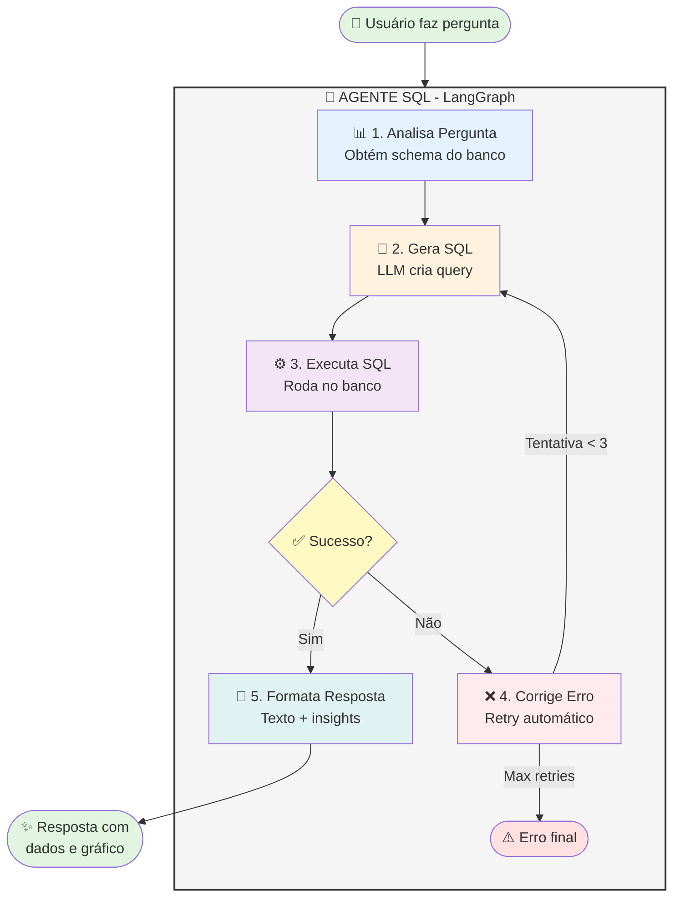
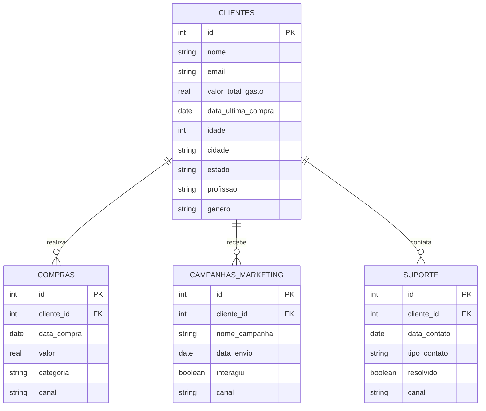

#  Assistente Virtual de Dados

> **Sistema inteligente de análise de dados que responde perguntas de negócio em linguagem natural**

Um assistente virtual capaz de atuar como um analista júnior, interpretando perguntas em português, gerando queries SQL automaticamente, executando-as no banco de dados e apresentando os resultados de forma visual e intuitiva.


##  Objetivo

Desenvolver um **Assistente Virtual de Dados inteligente**, capaz de atuar como um analista júnior para responder perguntas de negócio de forma independente, sem necessidade de queries SQL pré-programadas.

### Diferencial

Este sistema não apenas "segue um roteiro" - ele **navega por incertezas**, busca as próprias respostas e se **autocorrige** quando comete erros.

##  Características Principais

-  **Inteligência Artificial Avançada**: Usa LangChain e LangGraph para criar um agente que raciocina
-  **Autocorreção**: Detecta e corrige erros de SQL automaticamente (até 3 tentativas)
-  **Descoberta Dinâmica**: Não depende de queries hardcoded - descobre o schema do banco
-  **Visualizações Inteligentes**: Cria gráficos apropriados automaticamente
-  **Transparência**: Mostra todo o processo de raciocínio do agente
-  **Linguagem Natural**: Perguntas em português, sem conhecimento técnico necessário

##  Arquitetura

### Fluxo de Agentes (LangGraph)



**Como funciona:**
1. 📊 **Análise**: Entende a pergunta e carrega schema do banco
2. 🧠 **Geração**: LLM cria query SQL apropriada
3. ⚙️ **Execução**: Roda query no SQLite
4. ✅ **Validação**: Verifica se query funcionou
5. ❌ **Correção**: Se falhar, corrige automaticamente (até 3x)
6. 📝 **Formatação**: Gera resposta em português com insights

### Componentes do Sistema

1. **SQLAgent** (`src/agents/sql_agent.py`)
   - Núcleo do sistema usando LangGraph
   - Gerencia estados e transições do agente
   - Implementa lógica de retry e correção de erros

2. **DatabaseManager** (`src/utils/database.py`)
   - Gerencia conexões com SQLite
   - Descobre schema dinamicamente
   - Executa queries com tratamento de erros

3. **DataVisualizer** (`src/utils/visualizations.py`)
   - Cria visualizações automáticas (barras, linhas, pizza)
   - Detecta tipo de dado e escolhe melhor visualização

4. **Interface Streamlit** (`app.py`)
   - Interface web intuitiva
   - Mostra raciocínio do agente em tempo real
   - Exibe dados em tabelas e gráficos

##  Estrutura do Banco de Dados

O sistema trabalha com 5 tabelas principais no banco SQLite `anexo_desafio_1.db`:



**📊 Volume de Dados:**
- 👥 **Clientes**: 100 registros
- 🛒 **Compras**: 946 registros (2024-2025)
- 📧 **Campanhas de Marketing**: 248 registros
- 💬 **Suporte**: 273 registros

##  Instalação e Execução

### Pré-requisitos

- Python 3.9 ou superior
- Chave da API OpenAI ([obter aqui](https://platform.openai.com/api-keys))

### Passo a Passo

1. **Clone o repositório**

```bash
git clone <url-do-repositório>
cd Desafio1
```

2. **Crie um ambiente virtual**

```bash
# Windows
python -m venv venv
venv\Scripts\activate

# Linux/Mac
python3 -m venv venv
source venv/bin/activate
```

3. **Instale as dependências**

```bash
pip install -r requirements.txt
```

4. **Configure a API Key**

Crie um arquivo `.env` na raiz do projeto:

```bash
# Copie o exemplo
copy .env.example .env

# Edite o .env e adicione sua chave
OPENAI_API_KEY=sk-...
```

Ou configure diretamente:

```env
OPENAI_API_KEY=sk-proj-sua-chave-aqui
LANGCHAIN_MODEL=gpt-4o-mini
LANGCHAIN_TEMPERATURE=0
```

5. **Execute a aplicação**

```bash
streamlit run app.py
```

A aplicação abrirá automaticamente no navegador em `http://localhost:8501`

##  Exemplos de Uso

### Perguntas Básicas

**Pergunta:**
> "Quantos clientes temos no total?"

**Query gerada:**
```sql
SELECT COUNT(*) as total_clientes FROM clientes
```

**Resultado:** Tabela com o número total de clientes

---

**Pergunta:**
> "Liste os 5 estados com maior número de clientes que compraram via app em maio"

**Query gerada:**
```sql
SELECT c.estado, COUNT(DISTINCT c.id) as num_clientes
FROM clientes c
JOIN compras co ON c.id = co.cliente_id
WHERE co.canal = 'App' 
  AND strftime('%m', co.data_compra) = '05'
GROUP BY c.estado
ORDER BY num_clientes DESC
LIMIT 5
```

**Resultado:** Gráfico de barras + tabela com os estados

---

### Perguntas Complexas

**Pergunta:**
> "Quantos clientes interagiram com campanhas de WhatsApp em 2024?"

**Query gerada:**
```sql
SELECT COUNT(DISTINCT cliente_id) as clientes_whatsapp
FROM campanhas_marketing
WHERE canal = 'WhatsApp'
  AND interagiu = 1
  AND strftime('%Y', data_envio) = '2024'
```

---

**Pergunta:**
> "Qual a tendência de reclamações por canal no último ano?"

**Query gerada:**
```sql
SELECT 
    strftime('%Y-%m', data_contato) as mes,
    canal,
    COUNT(*) as num_reclamacoes
FROM suporte
WHERE tipo_contato = 'Reclamação'
  AND date(data_contato) >= date('now', '-1 year')
GROUP BY mes, canal
ORDER BY mes, canal
```

**Resultado:** Gráfico de linhas mostrando tendência temporal

---

### Mais Exemplos

-  "Quais categorias de produto tiveram o maior número de compras em média por cliente?"
-  "Qual o número de reclamações não resolvidas por canal?"
-  "Quais os 10 clientes que mais gastaram?"
-  "Qual a média de idade dos clientes por estado?"
-  "Quantas compras foram feitas por canal em 2024?"

##  Testando o Sistema

### Teste de correção automática

O sistema detecta e corrige erros automaticamente:

**Cenário:** Query inicial com erro de sintaxe

1. **Tentativa 1:** Gera SQL com nome de coluna incorreto
2. **Erro detectado:** `no such column: client_id`
3. **Tentativa 2:** Corrige para `cliente_id`
4. ** Sucesso**

### Teste de descoberta dinâmica

O agente não usa queries pré-programadas. Ele:
1. Descobre o schema do banco em tempo real
2. Analisa a pergunta
3. Gera SQL apropriado

Funciona mesmo com:
- Perguntas nunca vistas antes
- Combinações complexas de tabelas
- Agregações e filtros variados

##  Estrutura do Projeto

```
Desafio1/

 anexo_desafio_1.db          # Banco de dados SQLite
 app.py                       # Interface Streamlit
 requirements.txt             # Dependências Python
 .env.example                 # Exemplo de configuração
 .gitignore                   # Arquivos ignorados pelo git
 explore_db.py                # Script para explorar o banco
 README.md                    # Este arquivo

 src/
     __init__.py
     agents/
        __init__.py
        sql_agent.py         # Agente principal (LangGraph)
    
     utils/
         __init__.py
         database.py          # Gerenciamento do banco
         visualizations.py    # Criação de gráficos
```

##  Tecnologias Utilizadas

- **Python 3.9+**: Linguagem principal
- **LangChain**: Framework para aplicações com LLMs  
- **LangGraph**: Orquestração de agentes com grafos de estados
- **OpenAI GPT-4**: Modelo de linguagem
- **SQLite**: Banco de dados
- **Streamlit**: Interface web interativa
- **Plotly**: Visualizações interativas
- **Pandas**: Manipulação de dados

##  Como Funciona

### 1. Análise da Pergunta

O agente recebe a pergunta e o schema do banco:
```python
"Quantos clientes compraram em 2024?"
+ Schema do banco de dados
```

### 2. Geração de SQL

O LLM gera uma query SQL apropriada:
```sql
SELECT COUNT(DISTINCT cliente_id) 
FROM compras 
WHERE strftime('%Y', data_compra) = '2024'
```

### 3. Execução e Validação

- Query é executada no banco
- Se houver erro → volta para correção
- Se sucesso → continua para formatação

### 4. Apresentação

- Resposta em linguagem natural
- Tabela com dados
- Gráfico apropriado (se aplicável)
- Raciocínio do agente (transparência)

##  Melhorias Futuras

Sugestões para extensão do projeto:

### Funcionalidades

- [ ] **Memória de conversação**: Manter contexto entre perguntas
- [ ] **Suporte a múltiplos bancos**: PostgreSQL, MySQL, MongoDB
- [ ] **Cache de queries**: Evitar reprocessar perguntas similares
- [ ] **Exportação de relatórios**: PDF, Excel com gráficos
- [ ] **Agendamento**: Perguntas recorrentes automáticas
- [ ] **Alertas**: Notificações quando métricas mudarem

### Técnicas

- [ ] **RAG (Retrieval Augmented Generation)**: Para contexto adicional
- [ ] **Few-shot learning**: Exemplos de queries complexas
- [ ] **Fine-tuning**: Modelo especializado no domínio
- [ ] **Agentes especializados**: Um para cada tipo de análise
- [ ] **Validação semântica**: Checar se resultados fazem sentido
- [ ] **Explicabilidade**: Justificar cada decisão do agente

### Interface

- [ ] **Multi-idioma**: Suporte a inglês, espanhol
- [ ] **Modo escuro**: Tema dark mode
- [ ] **Histórico**: Salvar perguntas e respostas anteriores
- [ ] **Compartilhamento**: Compartilhar análises via link
- [ ] **Colaboração**: Múltiplos usuários
- [ ] **Dashboard**: Visão geral de métricas importantes

### Performance

- [ ] **Otimização de queries**: Análise de plano de execução
- [ ] **Paralelização**: Múltiplas queries simultâneas
- [ ] **Indexação inteligente**: Sugerir índices para o banco
- [ ] **Caching distribuído**: Redis para queries frequentes

##  Troubleshooting

### Erro: "No module named 'openai'"

**Solução:** Instale as dependências
```bash
pip install -r requirements.txt
```

### Erro: "OpenAI API key not found"

**Solução:** Configure o arquivo `.env`
```bash
echo OPENAI_API_KEY=sua_chave > .env
```

### Erro: "Unable to open database file"

**Solução:** Certifique-se de executar o app na pasta raiz
```bash
cd Desafio1
streamlit run app.py
```

### Query retorna erro repetidamente

**Causa:** Pergunta ambígua ou dados não disponíveis

**Solução:** Reformule a pergunta de forma mais específica

##  Licença

MIT License - Sinta-se livre para usar e modificar este projeto.

##  Autor

Desenvolvido como solução para o Desafio Franq - Assistente Virtual de Dados

---

** Dica:** Explore os exemplos na barra lateral da aplicação para ver o poder do sistema!

** Objetivo alcançado:** Sistema capaz de responder perguntas de negócio de forma completamente autônoma, com autocorreção e visualizações inteligentes.

