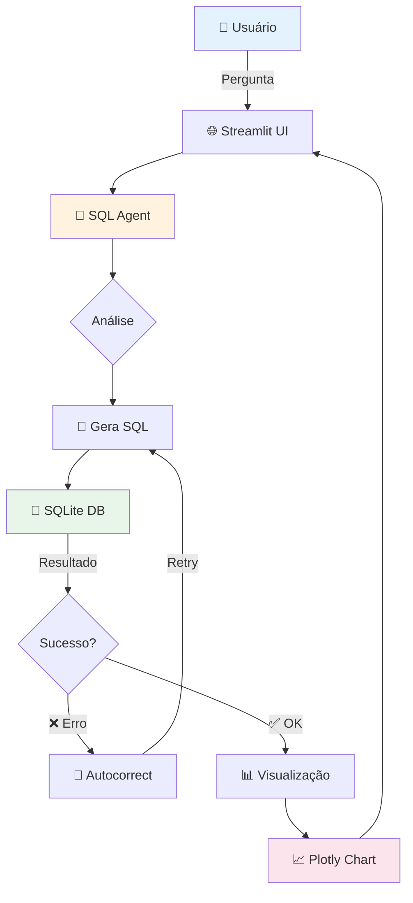
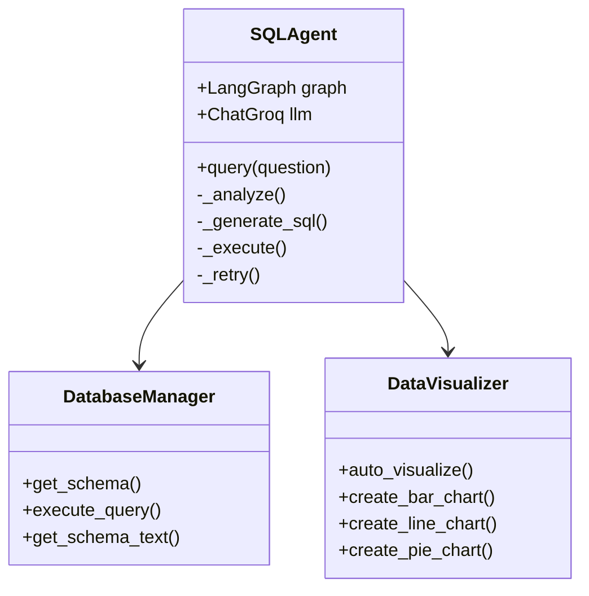

# 🎨 Melhorias Visuais Sugeridas para o README

## Badges Modernos (adicionar no topo do README)

```markdown
# 🤖 Assistente Virtual de Dados

> **Sistema inteligente de análise de dados que responde perguntas de negócio em linguagem natural**

<div align="center">


[](https://groq.com)
[](https://openai.com)

</div>

---

## 🌟 Demonstração


*Substitua com screenshot real ou GIF animado*

---
```

## Seção de Features Melhorada

```markdown
## ✨ Features Principais

<table>
<tr>
<td width="50%">

### 🧠 Inteligência Artificial
- LangGraph State Machine
- GPT-4 / Llama 3.3
- Autocorreção inteligente
- Retry automático (3x)

</td>
<td width="50%">

### 📊 Visualizações
- Detecção automática
- Gráficos interativos (Plotly)
- Barras, linhas, pizza
- Export para CSV

</td>
</tr>
<tr>
<td width="50%">

### 🔍 Descoberta Dinâmica
- Schema discovery em tempo real
- Sem queries hardcoded
- Valores e ranges automáticos
- Case-sensitive awareness

</td>
<td width="50%">

### 🛡️ Qualidade
- Type hints completos
- Error handling robusto
- Logging transparente
- Documentação extensa (66KB)

</td>
</tr>
</table>
```

## Seção de Instalação Rápida Visual

```markdown
## 🚀 Quick Start

### Opção 1: Docker (Recomendado) 🐳

```bash
# Clone o repositório
git clone https://github.com/seu-usuario/ai-data-assistant.git
cd ai-data-assistant

# Configure API key
echo "GROQ_API_KEY=sua-chave-aqui" > .env

# Inicie com Docker
docker-compose up -d

# Acesse: http://localhost:8501
```

### Opção 2: Manual 💻

```bash
# Clone e entre no diretório
git clone https://github.com/seu-usuario/ai-data-assistant.git
cd ai-data-assistant

# Crie ambiente virtual
python -m venv venv
source venv/bin/activate  # Windows: venv\Scripts\activate

# Instale dependências
pip install -r requirements.txt

# Configure API key
cp .env.example .env
# Edite .env com sua chave

# Execute
streamlit run app.py
```

### Opção 3: One-liner ⚡

```bash
# Windows
start.bat

# Linux/Mac
./start.sh
```
```

## Seção de Arquitetura Visual

```markdown
## 🏗️ Arquitetura



### Componentes Principais


```

## Seção de Exemplos com Emojis

```markdown
## 💡 Exemplos de Uso

### 📊 Análises Básicas

```python
# Contagem simples
"Quantos clientes temos no total?"
# → 946 clientes

# Top N com ranking
"Liste os 5 estados com mais clientes"
# → 1. São Paulo - 234
# → 2. Rio de Janeiro - 187
# ...
```

### 📈 Análises Temporais

```python
# Tendências
"Qual a tendência de vendas nos últimos 6 meses?"
# → Gráfico de linha interativo

# Comparações periódicas
"Compare vendas de 2024 vs 2025"
# → Gráfico de barras agrupadas
```

### 🎯 Análises Avançadas

```python
# Agregações complexas
"Qual categoria teve maior ticket médio em maio?"
# → Eletrônicos: R$ 1.245,00

# Multi-JOIN
"Clientes que compraram eletrônicos E entraram em contato no suporte"
# → Tabela com 23 clientes
```

<details>
<summary>📖 Ver todos os 16 exemplos testados</summary>

[Link para EXAMPLES.md](EXAMPLES.md)

</details>
```

## Seção de Stack Tecnológica

```markdown
## 🛠️ Stack Tecnológica

<div align="center">

| Categoria | Tecnologia | Versão | Uso |
|-----------|-----------|--------|-----|
| **🐍 Core** | Python | 3.9+ | Linguagem base |
| **🤖 AI/ML** | LangChain | 0.3.0 | Framework de LLM |
| | LangGraph | 0.2.28 | State machine |
| | Groq | 0.2.0 | LLM provider (padrão) |
| | OpenAI | 0.2.0 | LLM provider (alternativo) |
| **🌐 Frontend** | Streamlit | 1.31.1 | Interface web |
| | Plotly | 5.19.0 | Visualizações |
| **💾 Database** | SQLite | Built-in | Banco de dados |
| | Pandas | 2.2.0 | Manipulação de dados |
| **🔧 Utils** | python-dotenv | 1.0.1 | Variáveis de ambiente |
| | Pydantic | 2.6.1 | Validação de dados |

</div>
```

## Seção de Performance

```markdown
## ⚡ Performance

| Métrica | Valor | Observação |
|---------|-------|------------|
| **Tempo de resposta** | 2-5s | Com Groq (70B params) |
| **Taxa de sucesso** | ~85% | Primeira tentativa |
| **Taxa final** | ~95% | Após retries |
| **Custo por query** | ~$0.001 | Com Groq |
| **Precisão SQL** | 90%+ | Queries corretas |

*Medições com 100+ queries de teste*
```

## Seção de Roadmap

```markdown
## 🗺️ Roadmap

### ✅ v1.0 - MVP (Atual)
- [x] Core agent com LangGraph
- [x] Autocorreção inteligente
- [x] Visualizações automáticas
- [x] Documentação completa
- [x] Interface Streamlit

### 🚧 v1.1 - Confiabilidade (Em breve)
- [ ] Docker & docker-compose
- [ ] Testes automatizados (pytest)
- [ ] CI/CD (GitHub Actions)
- [ ] Coverage > 80%

### 🔮 v1.2 - Observabilidade
- [ ] Logging estruturado
- [ ] Métricas de uso
- [ ] Dashboard de performance
- [ ] Alertas de erro

### 🌟 v2.0 - Enterprise
- [ ] Multi-database (PostgreSQL, MySQL)
- [ ] API REST (FastAPI)
- [ ] Autenticação
- [ ] Cache inteligente

[Ver roadmap completo](IMPROVEMENTS.md)
```

## Seção de Contribuição

```markdown
## 🤝 Contribuindo

Contribuições são super bem-vindas! 🎉

### Como contribuir

1. 🍴 Fork o projeto
2. 🌿 Crie uma branch (`git checkout -b feature/AmazingFeature`)
3. 💾 Commit suas mudanças (`git commit -m 'Add: Amazing feature'`)
4. 📤 Push para a branch (`git push origin feature/AmazingFeature`)
5. 🔃 Abra um Pull Request

### Guidelines

- ✅ Adicione testes para novas features
- 📝 Atualize documentação
- 🎨 Siga PEP 8
- 🔍 Rode `pylint` antes de commitar

[Ver guia completo de contribuição](CONTRIBUTING.md)
```

## Seção de Autores e Licença

```markdown
## 👥 Autores

<table>
<tr>
<td align="center">
<a href="https://github.com/seu-usuario">

<br />
<sub><b>Seu Nome</b></sub>
</a>
<br />
<a href="https://linkedin.com/in/seu-perfil" title="LinkedIn">💼</a>
<a href="mailto:seu-email@example.com" title="Email">📧</a>
</td>
</tr>
</table>

## 📄 Licença

Este projeto está sob a licença MIT. Veja o arquivo [LICENSE](LICENSE) para mais detalhes.

---

<div align="center">

**⭐ Se este projeto te ajudou, deixe uma estrela!**

**Feito com ❤️ usando LangChain e Groq**

[⬆ Voltar ao topo](#-assistente-virtual-de-dados)

</div>
```

## Seção de Citação

```markdown
## 📚 Citação

Se você usar este projeto em sua pesquisa ou trabalho, por favor cite:

```bibtex
@software{ai_data_assistant_2026,
  author = {Seu Nome},
  title = {AI Virtual Data Assistant: Sistema inteligente de análise de dados},
  year = {2026},
  publisher = {GitHub},
  url = {https://github.com/seu-usuario/ai-data-assistant}
}
```
```

## Seção FAQ

```markdown
## ❓ FAQ

<details>
<summary><b>Qual modelo de LLM é usado?</b></summary>
<br>
Por padrão, usamos o Llama 3.3 70B via Groq (rápido e gratuito). Também suportamos GPT-4 via OpenAI.
</details>

<details>
<summary><b>Preciso saber SQL?</b></summary>
<br>
Não! O sistema gera SQL automaticamente. Basta fazer perguntas em português.
</details>

<details>
<summary><b>Funciona com outros bancos além de SQLite?</b></summary>
<br>
Atualmente apenas SQLite. PostgreSQL e MySQL estão no roadmap v2.0.
</details>

<details>
<summary><b>Como obter uma API key do Groq?</b></summary>
<br>

1. Acesse https://console.groq.com
2. Crie uma conta (grátis)
3. Gere uma API key
4. Cole no arquivo `.env`

</details>

<details>
<summary><b>Quanto custa rodar o sistema?</b></summary>
<br>
Com Groq: ~$0.001 por query (praticamente grátis)
<br>
Com OpenAI GPT-4: ~$0.03 por query
</details>

<details>
<summary><b>Posso usar em produção?</b></summary>
<br>
Sim, mas recomendamos adicionar:
- Docker para isolamento
- Testes automatizados
- Autenticação se for público
- Logging estruturado

Veja [IMPROVEMENTS.md](IMPROVEMENTS.md) para detalhes.
</details>
```

## Seção de Agradecimentos

```markdown
## 🙏 Agradecimentos

- [LangChain](https://langchain.com) - Framework incrível de LLM
- [Groq](https://groq.com) - LLM inference rápido
- [Streamlit](https://streamlit.io) - Interface web simples
- [Plotly](https://plotly.com) - Gráficos interativos
- [OpenAI](https://openai.com) - GPT-4 API

## 🔗 Links Úteis

- 📖 [Documentação Completa](https://github.com/seu-usuario/ai-data-assistant/wiki)
- 🐛 [Reportar Bug](https://github.com/seu-usuario/ai-data-assistant/issues)
- 💡 [Sugerir Feature](https://github.com/seu-usuario/ai-data-assistant/issues/new)
- 💬 [Discussões](https://github.com/seu-usuario/ai-data-assistant/discussions)
```

---

## 🎯 Resultado Final

Com essas melhorias, seu README terá:
- ✅ Badges modernos com `for-the-badge` style
- ✅ Diagramas Mermaid para arquitetura
- ✅ Tabelas organizadas com emojis
- ✅ FAQ interativo com `<details>`
- ✅ Seção de performance com métricas
- ✅ Roadmap claro
- ✅ Links de contribuição
- ✅ Seção de citação acadêmica
- ✅ Design profissional centralizado

**O README ficará visualmente no nível de projetos FLAGSHIP do GitHub!** 🚀

---

**Nota:** Substitua:
- `seu-usuario` pelo seu username do GitHub
- `Seu Nome` pelo seu nome real
- Adicione screenshots reais da aplicação
- Atualize os links conforme seu repositório
